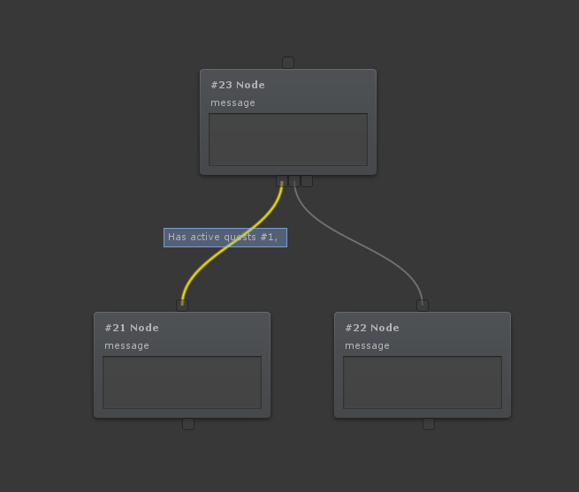

# Dialogue Editor

The Dialogue Editor uses nodes and edges to create a tree like structure.

Nodes are the boxes inside the dialogue editor. Each node represents an action. Either an action the player has to take or an action the system will take.

Edges are the lines between the nodes. Edges can have edge conditions to specify if that edge can be used. Edges are tried from left to right. The first edge that can be used will be used.

## Nodes

Nodes show the most important information inside the note to get a quick overview. When you click the node it will be shown in the sidebar. Here you can find all the information associated with the node.

All nodes (except for action nodes) have the following properties:

-   ownerType = The owner this node belongs to. This is used for auto focus, as well as a quick representation.
    -   Dialogue owner = This node belongs to the Dialogue Owner (npc) -  **Shown as a gray color**
    -   Player = This node belongs to the player -  **Shown as green**
-   useAutoFocus = Should auto focus be enabled for this node?
-   message = The message of this node. Can be left blank if you don't wish to use it.
-   Audio & Visuals
    -   audioInfo = The audio / voice acting that belongs to this node.
    -   motionInfo = The motion (animation) that belongs to this node.

## Special nodes & edges

The nodes specify which edge should be used when moving to the next node. For example, the PlayerInputNode requires the player to input a string (some text). If the user input matches the expected string (in this case 4) the first green edge will be used. If the user answered incorrectly the second red line will be used.

Note that you can output variable names in the node messages by putten them in curly braces. For example: If you have a variable UserInput you can put {UserInput} in your code and it will replace that text with the variable's value.

## Edge conditions

Edge conditions are (custom) conditions that can be added to the edges. Because an edge connects 2 nodes applying a condition to the edge can determine if the edge is allowed to be travelled. What does this mean?

Let's use the following picture as an example. Edges are tried from left to right. If an edge can not be used the next edge will be tried, and so on. In the image below you can see there's an edge condition on the left edge. This requires the player to have an active quest with ID 1. If the player  **does** have the quest the edge can be used, and the left node will be activated. If the user however does not have an active quest with ID 1 the left edge cannot be used and therefore the right edge leading to the right node will be used instead.

!!! note
	If no edges can be used the node can not continue, so it's a good idea to always have 1 edge without conditions that can always be used.
	
