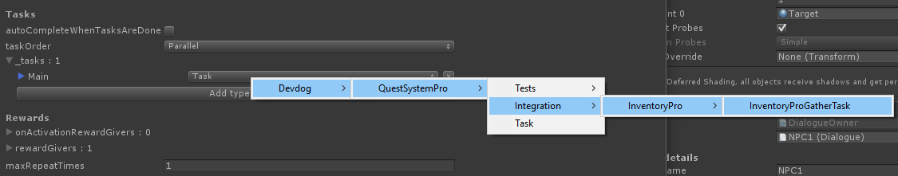

# Inventory pro integration

The Inventory Pro setup is very straight forward.

1. Add the QuestSystemInventoryProBridgeManager to your managers object.

2. Add the QuestSystemPlayer component to your player.

2.1 Of course make sure that both the Quest System Pro's managers as well as the Inventory Pro's managers are in the scene. They can be on the same objecd, but don't have to be.

3. That's it...

## Inventory Pro quests

In combination with Inventory Pro you may want to create quests to gather items. This can be done by creating InventoryProGatherTasks.

You can create such a task by going to the main quest editor, creating a task and selecting the InventoryProGatherTask from the dropdown (that says "Task").

OR

You can create a new InventoryProGatherTask directly by clicking the dropdown area on the Add type button, which will show the same context menu.

Once the task has been added you'll be able to select the item you wish to gather. If you'd like the player to gather a variation of items simply create more tasks.

The _progressCap will define how many items have to be gathered by the player.

