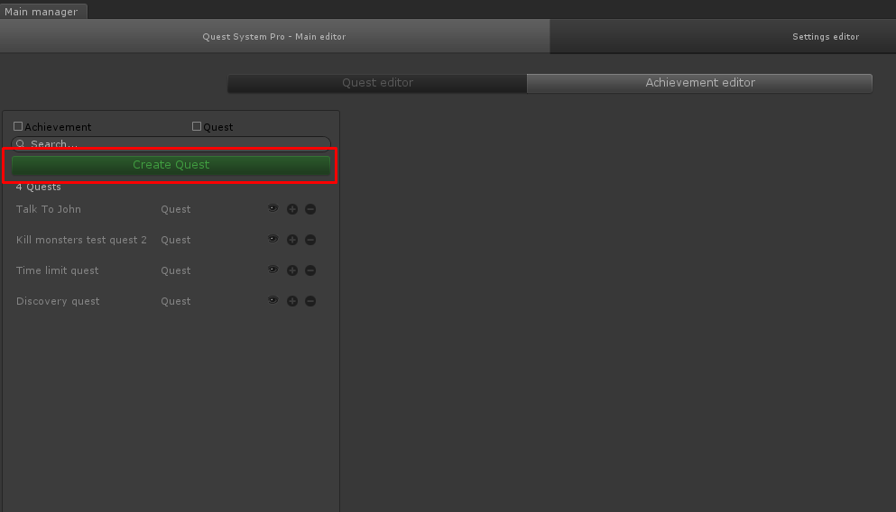

# Creating a new quest

In the main editor you can create new quests and achievements. To create a new quest click the "Create Quest" button on the left.

Once you click the Create Quest editor button the type picker shows. Here you chooose what type of quest you'd like to create. As for now, there's only 1 type of quest. Howerver, using this, you have the ability to create your own type of quests, just in case the built-in one doesn't suit you.

Select the quick type you'd like to create and voila. Your quest is created. The quest will be added to the list on the left, and automatically selected.

## What do all these options do?

-   Name = The name of the quest
-   Description = The description of the quest
-   Icon = The icon of the quest (can be displayed in the UI)
-   autoCompleteWhenTasksAreDone = Automatically complete the entire quest (and give rewards) if all tasks are completed.
-   taskOrder = The task order.
    -   Parallel = All tasks are started at the same time. If tasks use a timer these all begin counting at the same time.
    -   Single = The first valid task starts. Once it's completed the next task starts, until the last task is reached.
-   Tasks = The tasks that belong to this quest. Each task is an 'action' the player has to to perform.
    -   Key = The unique key for this task. It's recommended to use consistent naming such as Main, Main2, Main3... Or Task1, Task2, Task3 and so on.
    -   Description = The description of the task.
    -   statusMessage = The status of the task.
        -   The following variables can be used inside the statusMessage
        -   {0} = Progress
        -   {1} = Progress normalized (0...1)
        -   {2} = Progress Cap (Amount of actions required)
    -   Icon = The icon of this task
    -   Progress Cap = The amount of progress the user has to achieve to complete this task. For example, if you have a quest: Kill 5 monsters the progress cap would be 5. If you have a quest gather 3 apples the progress cap would be 3. If you have a task: Talk to an NPC the progress cap would be 1 (as the action has to be performed 1 times).
    -   autoComplete = If the task has enough progress it will auto be completed (note that overachievement is not possible with autoComplete enabled).
    -   useTimeLimit = Use a time limit on this task?
    -   timeLimitInSeconds = The time limit for this task in seconds.
    -   Requirement = Is this task required or optional? By default if a required task is failed (by being out of time for example) the quest will be cancelled.
    -   giveRewardsOnTaskComplete = Give this task's rewards as soon as the task is completed. When false the reward will be given when the quest is completed.
    -   reward Givers = The rewards the player receives when completing this task. (Custom reward givers can also be implemented)
    -   overAchievements = Over achievements can be used when your player puts in extra effort. For example, you have a quest: Gather 5 apples, if the player overachieves and gathers 10 apples he's achieved the quest by 200% (which is a muliplier of 2.0). In the TaskOverAchievement you can specify on what range of overachievement the player will receive extra rewards. For example: An overachievement with the values from = 1.5 and to = 2; And a task: Gather 5 apples. If the player gathers 8-10 apples he can be given extra rewards.
-   OnActivationRewardGivers: Give the player a reward when the quest is started.
-   rewardGivers: The rewards for completing this quest. Note that the player will receive both the quest rewards AND the completed task's rewards.
-   maxRepeatTimes = How many times can this quest be repeated?
-   requiresFinishedQuests = The quests that have to be completed before this quest can be activated.
-   conditions = The conditions the player has to meet in order to accept / complete / cancel the quest. Custom implementations can be added if needed.
-   timeHandler = The time handler handles the timing for the quests. By default you have the option to cancel the quest if a task is not completed within it's time frame. A custom implementation of this can be added.
