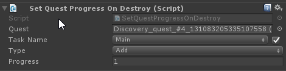
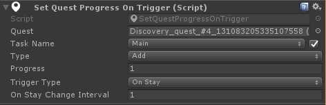

# Quest Progress Setters

Quest progress setters are small components that help you set progress on a quest when a certain event or actaion happens. For example, when an object is destroyed you may want to set progress on a quest.

## Set Quest Progress On Destroy

**Quest**: The quest you want to set progress on

**Task name**: The task name that you want to set the progress on

**Type**:

-   **Add**: Add the progress amount to the quest task
-   **Set**: Set the value to progress, this overwrites any previous progress.

**Progress**: The amount of progress to add to the quest task.

## Set Quest Progress On Trigger

The Set Quest Progress On Trigger component can be used to set progress when the player enters, stays or exits a trigger. This can be useful for discovery quests, but also to make sure the player walks in the right direction by setting up area's the player has to visit.

When using the On Stay trigger type the progress will be set or added at every interval. For example, with an interval of 1 second the progress will be set or added every second.

## Set Quest Progress On Trigger Object

The Set Quest Progress On Trigger Object can be used to set or add progress when a trigger (such as a NPC) is used. This could be used to reward the player when he/she talks to an NPC, but can also be used for non-living objects in the world.

