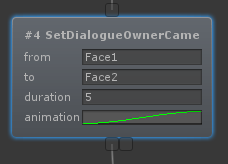

# Dialogue Camera

The DialogueCamera is a component that can be used to focus on a player or a certain position.

!!! note
	If you wish to use a dialogue camera for an NPC it's recommended to make the DialogueCamera object a child of the NPC.

New positions can be added by clicking the Plus icon in the bottom right corner. By clicking the camera position the visual representation (viewing frustum) will show up green inside the Unity editor. By positioning the editor camera to a position and clicking on "Copy from editor camera" the position will be saved.

Once the positions have been set we can use our dialogue to focus on one of these positions for a specified amount of time or until a new position overrides it.

In the Dialogue editor we have some components that can help us with this. For example the SetDialogueOwnerCameraPosition. This node sets the dialogue owner (the NPC's) camera position.

From = The 'key' as defined in the DialogueCamera component.

To = The 'key' we want to move towards (this creates a transitions between the From key and the To key).

Duration = The amount of time we want to show this shot. If both From and To are set the transition will take this long to complete.

Animation = The AnimationCurve we want to use for this animation. By default this is EaseInOut.

## Auto Focus

When the dialogue is running you may want to focus the camera on the one that's speaking. This can be done by hand, but this is a lot of work. Optionally you can use the DialogueCamera's and the AutoFocus components to automate this process.

There's 2 components that handle the auto focus. There's the DialogueOwnerAutoFocus and the DialoguePlayerAutoFocus. As you may have figured out already, the owner is for the NPC and the player is for the main player's character.

Simply add the component to the same object that has the DialogueOwner component (**so to the NPC, not the DialogueCamera object**).

Use interpolation = This will automatically try to interpolate between 2 randomly chosen points.

Interpolation time = The speed of the interpolation animation.

Focus names = The names (these have to exist in the DialogueCamera component) used to randomly set the position of the camera.

