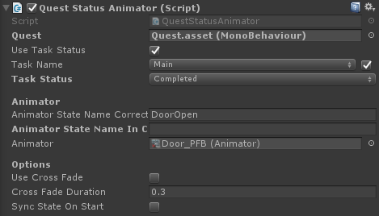

# Quest Object Affectors

Quest object affectors are small components that allow you to affect any object in your scene when a quest's status changes. For example, enable an object when the player starts a quest, or play an animation on any object when the player completes his/her quest.

## Quest Status Object Enabler

**Quest**: The quest we want to respond to when it's status changes

**Quest Status**: When the quest is 'this' status perform the 'action' (see below).

**Use Task Status:** When checked you can listen to a quest's task status change instead of the quest itself.

**Action:** When the quest is the status we expect it to be (active in the image below), enable the object. If the quest is not this status the opposite action is performed (disable).

## Quest Status Animator

The Quest Status Animator allows you to animate any object in the scene when a quest or quest task has changed it's status.

**State name correct:** The animator state that will be played when the quest / quest task's status matches the specified settings.

**State name incorrect:** The animator state that will be played when the quest / task's status does not match the specified settings.

**Use Cross Fade:** When using crossfade the state that will be played will be faded into the existing animation. This will prevent snappy animation changes.

**Sync State On Start:** When enabled the state of the quest will be tested at the start of the game, and animated if needed. When the game starts you may want to sync up with the player's save data, in which case you'll want to check this option.

## Quest Status Object Destructor

Destroy the object when the quest's status matches the settings (active in the image below).

